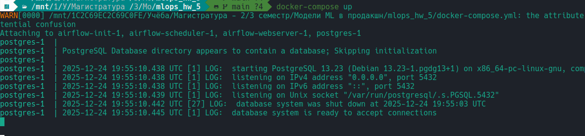
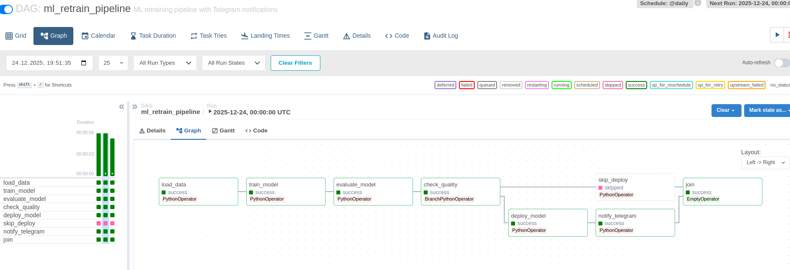
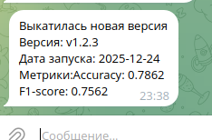
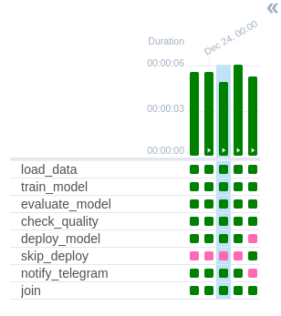

# mlops_hw_5
Модификация DAG в Airflow для уведомлений о выводе новой модели в продакшен

Уведомления приходят в Телеграм

## Описание DAG
1. Последовательно запускаются задачи load_data(загрузка данных) => train_model(тренировка модели) => evaluate_model(оценка) => check_quality
2. check_quality - проверка метрик и развилка
2.1. Метрики >= пороговых => deploy_model
2.2. Метрики < пороговых => skip_deploy
3. notify_telegram при если выполнилось 2.1
4. join - конечная точка, заверщшение всех веток (DummyOperator)

## Подготовка запуска

Создать .env (есть файл-шаблон .env.example), задать TELEGRAM_BOT_TOKEN и TELEGRAM_CHAT_ID

## Запуск DAG

1) Запуск Airflow:

`docker-compose up`

2) На http://localhost:8080 ввести admin/admin

3) Получение нотификации в телеграме:

4) Если метрики ниже желаемых - то пойдёт по другому пути:

